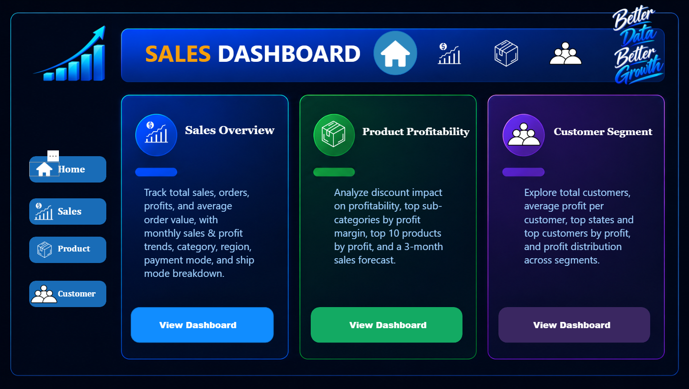

# 📊 Sales Dashboard - Power BI

An end-to-end interactive Power BI Sales Analytics Dashboard designed to analyze multi-region sales performance, product profitability, customer segmentation, and 3-month sales forecasting.

---

## 📌 Project Overview

This Power BI project converts raw transactional sales data into actionable business intelligence. It provides dynamic navigation across specialized reporting views to track total revenue, profit margins, discount impacts, and top-performing customer profiles across multiple territories.

---

## 🎯 Objectives

* **Sales Performance Tracking:** Monitor total sales, order count, total profits, and average order values across time.
* **Profitability Analysis:** Analyze the negative and positive impacts of discount rates on product sub-categories and identify top-profit products.
* **Customer Segmentation:** Identify high-value customers, top-performing states, and sales distribution by customer segment.
* **Sales Forecasting:** Generate a 3-month predictive sales trend using time-series forecasting.

---

## 📊 Dashboard Pages & Features

### 1. Home / Navigation Hub
* **Unified Navigation Bar:** Page-level page navigation buttons (`Home`, `Sales`, `Product`, `Customer`).
* **Executive Summary Cards:** Direct navigation routing to Sales Overview, Product Profitability, and Customer Segment modules.

### 2. Sales Overview Page
* **Key Performance Indicators (KPIs):**
  * Total Sales: **$2.30M** (+46.95% vs LY)
  * Total Orders: **5.01K** (+51.01% vs LY)
  * Total Profit: **$286.40K** (+48.48% vs LY)
  * Avg Ship Days: **4 days** (-0.63% vs LY)
  * Avg Order Value: **$459** (-2.69% vs LY)
* **Sales Trends & Breakdowns:** Monthly sales & profit trends, payment mode share (Cards 35.06%, Cash 31.51%, Online 33.43%), region distribution (West 31.58%, East 29.55%), category breakdown, and top 5 sub-categories (Phones & Chairs leading at $0.33M each).
* **Geographic Analysis:** Total sales distribution map across US States (California leading at $0.46M).

### 3. Product Profitability Page
* **Discount Impact Scatter Chart:** Evaluates profit levels against discount percentages (0% to 80%) across Furniture, Office Supplies, and Technology.
* **Profit Margin Analysis:** Top 5 sub-categories by profit margin (Labels 44.42%, Paper 43.39%, Envelopes 42.27%, Copiers 37.20%, Fasteners 31.40%).
* **Top Products:** Table identifying top products by total profit (Led by *Canon imageCLASS 2200 Advanced Copier* generating **$25,199.93**).
* **3-Month Sales Forecast:** Predictive trend modeling showing expected monthly sales variations.

### 4. Customer Segment Page
* **Customer KPIs:** Total Customers (**793**), Avg Profit per Customer (**$361.16**).
* **Top Customer Rankings:** Top 10 customers listed by revenue and profit contribution (Led by *Tamara Chand* at $19,052.22 sales and $8,981.32 profit).
* **Geographic & Segment Breakdowns:** Top 5 states by customer count (California, New York, Texas, Pennsylvania, Illinois) and Profit distribution by segment (Consumer $134K, Corporate $92K, Home Office $60K).

---

## 📈 Key Business Insights

* **Peak Sales Season:** Revenue peaked significantly during November, driven by end-of-year buying trends.
* **Category Leader:** Technology generates the maximum overall revenue ($0.84M), with Phones and Chairs as top revenue sub-categories.
* **Geographic Leader:** The **West region** contributes the highest overall sales revenue ($0.71M / 30.74%), with **California** being the single highest-performing state ($0.46M).
* **Profitability Watch:** Heavy discounting above 20% severely degrades profit margins across Office Supplies and Furniture categories.
* **Top Customer:** *Tamara Chand* is the highest profit-generating customer ($8,981.32 profit).

---

## 🛠️ Tools & Technologies

* **Power BI Desktop:** Dashboard design, custom layout, interaction wiring, and visual engineering.
* **Power Query:** Data transformation, field cleaning, and column structuring.
* **DAX (Data Analysis Expressions):** Custom measures for % growth Year-Over-Year (%chg LY), KPI calculations, and profit margins.
* **Data Modeling:** Star schema modeling connecting sales, regional, product, and date tables.

---

## 📸 Dashboard Preview

### 1. Home / Navigation

### 2. Sales Overview

### 3. Product Profitability

### 4. Customer Segment

---

## 👨‍💻 Author

**Salman Morol**  
*Aspiring Data Analyst*  
* **Skills:** Power BI | DAX | Power Query | SQL | Excel | Data Modeling

---
⭐ *If you found this project insightful, feel free to give this repository a star!*
